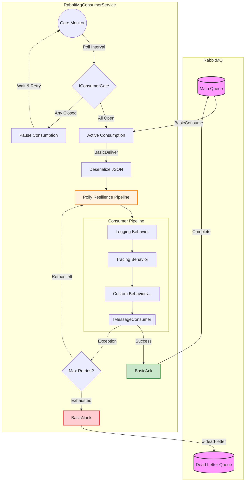

# Messaging.Core

A Broker-agnostic messaging template.
It provides robust, resilient, and observable abstractions while currently offering a highly tuned implementation for RabbitMQ.

## Architecture & Execution Flow

The following diagram illustrates the lifecycle of a message from the broker through the internal execution pipeline, including gates, resilience policies, and behaviors.



## Key Features

1. **Clean Abstractions:** `IMessageConsumer<T>`, `IMessage`, and `IMessagePublisher` separate your business logic from the underlying broker implementation.
2. **Resilience (Polly v8):** Configurable exponential backoff retries with full jitter. Automatically routes messages to a Dead Letter Queue (DLQ) after configured `MaxRetryAttempts`.
3. **Consumer Gates (`IConsumerGate`):** Pause consumption at the broker level when external dependencies (e.g., an API or Database) are unavailable, and automatically resume delivery when they recover.
4. **Pipeline Behaviors:** Middleware execution pipeline for consumer handlers (`IConsumerPipelineBehavior<TMessage>`). Built-in behaviors include global `LoggingBehavior` and `TracingBehavior`.
5. **Observability:** 
   - **OpenTelemetry:** Creates distributed traces automatically connecting publishers and consumers. The `ActivitySource` name is provided by the implementer.
   - **Structured Logging:** High-performance Serilog integration using `[LoggerMessage]` delegates.
6. **Graceful Shutdown:** Drains in-flight messages cleanly before closing the channel, utilizing a configurable `ShutdownTimeoutSeconds`.
7. **K8s-Ready:** Fully integrated with `AspNetCore.HealthChecks.RabbitMQ`, providing automated readiness and liveness probes.

## Quick Start
Register your broker, publishers, and consumers in `Program.cs`. 
You can chain global behaviors and consumer-specific gates gracefully.

```csharp
using Messaging.Core.Extensions;
using Messaging.Core.Pipeline;

var builder = WebApplication.CreateBuilder(args);

// 1. Add Broker and Publisher
builder.Services
    .AddRabbitMqBroker(builder.Configuration)
    .AddRabbitMqPublisher();

// 2. Add Global Behaviors (applied to all consumers)
builder.Services
    .AddGlobalConsumerBehavior(typeof(LoggingBehavior<>))
    .AddGlobalConsumerBehavior(typeof(TracingBehavior<>));

// 3. Register Consumers with Gates
builder.Services
    .AddConsumer<SampleMessage, SampleConsumer>("sample-queue")
    .WithGate<SampleDatabaseGate>(); // Consumption pauses if DB is unreachable

// 4. Observability & Health
builder.Services
    .AddConsumerHealthChecks();
builder.Services
    .AddOpenTelemetry()
    .AddConsumerTracing("Messaging.Sample");

var app = builder.Build();

app.MapHealthEndpoint();
await app.RunAsync();
```

## Consumer Example

Consumers simply implement `IMessageConsumer<TMessage>` and focus purely on business logic:

```csharp
using Messaging.Core.Abstractions;

public class SampleMessage : IMessage
{
    public Guid MessageId { get; init; } = Guid.NewGuid();
    public string Payload { get; init; } = string.Empty;
}

public class SampleConsumer(ILogger<SampleConsumer> logger) : IMessageConsumer<SampleMessage>
{
    public async Task ConsumeAsync(SampleMessage message, CancellationToken cancellationToken)
    {
        logger.LogInformation("Processing message: {Payload}", message.Payload);
        // Throwing an exception here automatically triggers Polly retries 
        // and eventually routing to the DLQ.
    }
}
```

## Configuration

Settings are bound from the `RabbitMq` and `Consumer` sections in `appsettings.json`.

```json
{
  "RabbitMq": {
    "Host": "localhost",
    "Port": 5672,
    "VirtualHost": "/",
    "Username": "guest",
    "Password": "guest", // Should be overridden via Environment Variables or Kubernetes Secrets.
    "EnableDeadLetterQueue": true
  },
  "Consumer": {
    "QueueName": "default-queue",
    "ConcurrencyLimit": 10,
    "MaxRetryAttempts": 3,
    "RetryBaseDelayMs": 100,
    "ShutdownTimeoutSeconds": 30,
    "GatePollingIntervalSeconds": 10
  }
}
```
