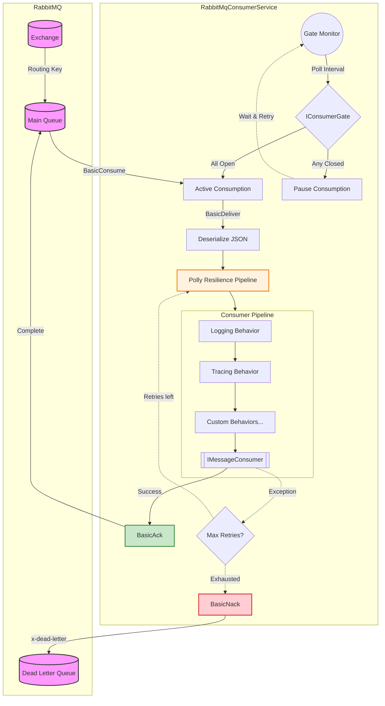

# Messaging.Core

A Broker-agnostic messaging template.
It provides robust, resilient, and observable abstractions while currently offering a highly tuned implementation for RabbitMQ.

## Architecture & Execution Flow

The following diagram illustrates the lifecycle of a message from the broker through the internal execution pipeline, including gates, resilience policies, and behaviors.



## Key Features

1. **Clean Abstractions:** `IMessageConsumer<T>`, `IMessage`, and `IMessagePublisher` separate your business logic from the underlying broker implementation.
2. **Exchange + Routing Key Binding:** First-class support for exchange-based message routing. Consumers auto-declare exchanges, queues, and bindings during startup. Direct queue consumption is also supported.
3. **Resilience (Polly v8):** Configurable exponential backoff retries with full jitter. Automatically routes messages to a Dead Letter Queue (DLQ) after configured `MaxRetryAttempts`.
4. **Consumer Gates (`IConsumerGate`):** Pause consumption at the broker level when external dependencies (e.g., an API or Database) are unavailable, and automatically resume delivery when they recover.
5. **Pipeline Behaviors:** Middleware execution pipeline for consumer handlers (`IConsumerPipelineBehavior<TMessage>`). Built-in behaviors include global `LoggingBehavior` and `TracingBehavior`.
6. **Observability:** 
   - **OpenTelemetry:** Creates distributed traces automatically connecting publishers and consumers. The `ActivitySource` name is provided by the implementer.
   - **Structured Logging:** High-performance Serilog integration using `[LoggerMessage]` delegates.
7. **Graceful Shutdown:** Drains in-flight messages cleanly before closing the channel, utilizing a configurable `ShutdownTimeoutSeconds`.
8. **K8s-Ready:** Fully integrated with `AspNetCore.HealthChecks.RabbitMQ`, providing automated readiness and liveness probes.

## Quick Start

Register your broker, publishers, and consumers in `Program.cs`. 
You can chain global behaviors and consumer-specific gates gracefully.

```csharp
using Messaging.Core.Extensions;
using Messaging.Core.Pipeline;

var builder = WebApplication.CreateBuilder(args);

// 1. Add Broker and Publisher
builder.Services
    .AddRabbitMqBroker(builder.Configuration)
    .AddRabbitMqPublisher();

// 2. Add Global Behaviors (applied to all consumers)
builder.Services
    .AddGlobalConsumerBehavior(typeof(LoggingBehavior<>))
    .AddGlobalConsumerBehavior(typeof(TracingBehavior<>));

// 3. Register a Consumer (see "Consumer Registration" section below)
builder.Services
    .AddConsumer<SampleMessage, SampleConsumer>(
        exchangeName: "my-exchange",
        routingKey: "sample.messages")
    .WithGate<SampleDatabaseGate>();

// 4. Observability & Health
builder.Services.AddConsumerHealthChecks();
builder.Services
    .AddOpenTelemetry()
    .AddConsumerTracing("Messaging.Sample");

var app = builder.Build();

app.MapHealthEndpoint();
await app.RunAsync();
```

---

## Consumer Registration

Messaging.Core provides two `AddConsumer` overloads to cover all RabbitMQ consumption patterns. Choose the one that matches how messages arrive at your queue.

### Approach 1: Exchange + Routing Key (Recommended)

```csharp
public static ConsumerBuilder<TMessage> AddConsumer<TMessage, TConsumer>(
    this IServiceCollection services,
    string exchangeName,
    string routingKey,
    string? queueName = null,       // defaults to routingKey if omitted
    string exchangeType = "direct") // direct | topic | fanout | headers
```

**Use this when:** A producer publishes messages to an **exchange** with a **routing key**, and a queue is bound to that exchange to receive them. This is the standard RabbitMQ pattern and covers the vast majority of real-world use cases.

**What it does at startup:**
1. Declares the exchange (idempotent, `durable: true`)
2. Declares the queue (uses `routingKey` as the queue name if `queueName` is not provided)
3. Binds the queue to the exchange with the routing key
4. Sets up DLQ topology if enabled

**Examples:**

```csharp
// Minimal — queue name defaults to the routing key ("order.created")
builder.Services
    .AddConsumer<OrderMessage, OrderConsumer>(
        exchangeName: "order-exchange",
        routingKey: "order.created");

// Explicit queue name
builder.Services
    .AddConsumer<OrderMessage, OrderConsumer>(
        exchangeName: "order-exchange",
        routingKey: "order.created",
        queueName: "order-processing-queue");

// Topic exchange — wildcards in routing key
builder.Services
    .AddConsumer<AuditEvent, AuditConsumer>(
        exchangeName: "events",
        routingKey: "audit.#",
        queueName: "audit-all",
        exchangeType: "topic");

// Fanout exchange — all messages broadcast to all bound queues
builder.Services
    .AddConsumer<NotificationMessage, NotificationConsumer>(
        exchangeName: "notifications",
        routingKey: "",
        queueName: "email-notifications",
        exchangeType: "fanout");
```

### Approach 2: Direct Queue (No Exchange Binding)

```csharp
public static ConsumerBuilder<TMessage> AddConsumer<TMessage, TConsumer>(
    this IServiceCollection services,
    string queueName)
```

**Use this when:** Messages are published directly to a named queue using the **default exchange** (empty string). No explicit exchange binding is needed because RabbitMQ's default exchange automatically routes messages to a queue whose name matches the routing key.

**What it does at startup:**
1. Declares the queue (idempotent, `durable: true`)
2. Sets up DLQ topology if enabled
3. No exchange is declared or bound

**Example:**

```csharp
builder.Services
    .AddConsumer<LegacyMessage, LegacyConsumer>(
        queueName: "legacy-import-queue");
```

### When to Use Which

| Scenario | Approach | Why |
|---|---|---|
| Standard microservice messaging | **Exchange + Routing Key** | Decouples producers from consumers; queues can be added/removed without changing the producer |
| Fan-out to multiple consumers | **Exchange + Routing Key** (fanout) | Multiple queues bind to the same exchange; each gets a copy |
| Topic-based filtering | **Exchange + Routing Key** (topic) | Routing key wildcards (`*`, `#`) enable flexible message filtering |
| Simple point-to-point | **Direct Queue** | When you own both producer and consumer and don't need exchange-level routing |
| Legacy / existing queue | **Direct Queue** | When consuming from a pre-existing queue created outside your control |
| Third-party integration | **Direct Queue** | When the producer uses `BasicPublish` to the default exchange |

> **Rule of thumb:** If in doubt, use **Exchange + Routing Key**. It's the idiomatic RabbitMQ pattern and gives you flexibility to evolve your messaging topology without code changes.

---

## Publishing Messages

Use `IMessagePublisher` to publish messages. Two methods are available, matching the two consumption patterns:

```csharp
// Publish to an exchange with a routing key (standard pattern)
await publisher.PublishAsync(message, "my-exchange", "order.created");

// Publish directly to a queue via the default exchange
await publisher.PublishToQueueAsync(message, "legacy-import-queue");
```

| Method | Exchange | Routing Key | Use Case |
|---|---|---|---|
| `PublishAsync(msg, exchange, routingKey)` | Named exchange | Explicit routing key | Standard exchange-based routing |
| `PublishToQueueAsync(msg, queueName)` | Default (`""`) | Queue name | Direct queue delivery |

---

## Consumer Example

Consumers simply implement `IMessageConsumer<TMessage>` and focus purely on business logic:

```csharp
using Messaging.Core.Abstractions;

public class SampleMessage : IMessage
{
    public Guid MessageId { get; init; } = Guid.NewGuid();
    public string Payload { get; init; } = string.Empty;
}

public class SampleConsumer(ILogger<SampleConsumer> logger) : IMessageConsumer<SampleMessage>
{
    public async Task ConsumeAsync(SampleMessage message, CancellationToken cancellationToken)
    {
        logger.LogInformation("Processing message: {Payload}", message.Payload);
        // Throwing an exception here automatically triggers Polly retries 
        // and eventually routing to the DLQ.
    }
}
```

---

## Configuration

Settings are bound from the `RabbitMq` and `Consumer` sections in `appsettings.json`.

### Exchange + Routing Key Configuration

```json
{
  "RabbitMq": {
    "Host": "localhost",
    "Port": 5672,
    "VirtualHost": "/",
    "Username": "guest",
    "Password": "guest"
  },
  "Consumer": {
    "ExchangeName": "my-exchange",
    "RoutingKey": "order.created",
    "ExchangeType": "direct",
    "ConcurrencyLimit": 10,
    "MaxRetryAttempts": 3,
    "RetryBaseDelayMs": 100,
    "EnableDeadLetterQueue": true,
    "ShutdownTimeoutSeconds": 30,
    "GatePollingIntervalSeconds": 10
  }
}
```

### Direct Queue Configuration

```json
{
  "Consumer": {
    "QueueName": "legacy-import-queue",
    "ConcurrencyLimit": 10,
    "MaxRetryAttempts": 3,
    "RetryBaseDelayMs": 100,
    "EnableDeadLetterQueue": true,
    "ShutdownTimeoutSeconds": 30,
    "GatePollingIntervalSeconds": 10
  }
}
```

### Consumer Options Reference

| Property | Description | Default |
|---|---|---|
| `ExchangeName` | Exchange to bind the queue to | — |
| `RoutingKey` | Routing key for exchange → queue binding | — |
| `ExchangeType` | Exchange type: `direct`, `topic`, `fanout`, `headers` | `direct` |
| `QueueName` | Queue name (defaults to `RoutingKey` if omitted) | — |
| `ConcurrencyLimit` | Max concurrent messages (RabbitMQ prefetch count) | `1` |
| `MaxRetryAttempts` | Retries before routing to DLQ | `3` |
| `RetryBaseDelayMs` | Base delay for exponential back-off | `500` |
| `EnableDeadLetterQueue` | Route failed messages to DLQ | `true` |
| `GatePollingIntervalSeconds` | Gate re-evaluation interval | `10` |
| `ShutdownTimeoutSeconds` | Max wait for in-flight messages on shutdown | `30` |

> **Validation:** Either `ExchangeName` + `RoutingKey` must be set, or `QueueName` must be set. When using exchange binding, `QueueName` is optional and defaults to `RoutingKey`.
